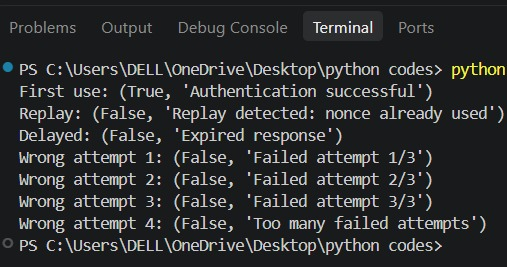

# Experiment 3: Simulate User Authentication and Replay Attack Handling Using Challenge-Response Protocol
 
## Objective
 
To develop a basic challenge-response authentication system to validate user identity and simulate replay attack detection.
 
## Brief Theory 
 
### Challenge-Response Authentication 
 
An authentication method in which the system sends a unique challenge, and the user generates a valid response using a shared secret.
 
### Nonce 
 
A randomly generated value used only once during authentication to make each challenge unique and prevent replay attacks.
 
### HMAC 
 
Hash-based Message Authentication Code (HMAC) uses a secret key with a hash function to verify the integrity and authenticity of a message.
 
### Replay Attack 
 
An attack in which an attacker captures a valid authentication response and retransmits it to gain unauthorized access.
 
### Timestamp 
 
A timestamp is used to limit the validity of an authentication response. In this experiment, a response is accepted only within 5 seconds of the current time.
 
## Procedure 
 
1. **Initialize the shared secret:** A common secret key is defined between the user and authentication system.
 
2. **Generate a challenge:** When authentication starts, a random 16-byte hexadecimal nonce is generated using the `secrets` module. The username and challenge timestamp are stored.
 
3. **Create the authentication response:** The username, nonce, and timestamp are combined into a message. HMAC-SHA256 is generated using the shared secret.
 
4. **Send the response:** The response consists of the username, nonce, timestamp, and HMAC tag.
 
5. **Verify the response:** The system checks whether the nonce has already been used, verifies that it belongs to the correct username, checks whether the timestamp is within the allowed 5-second limit, and compares a newly calculated HMAC with the received HMAC.
 
6. **Handle replay attacks:** After a nonce is used, it is added to the `used_nonces` set. If the same nonce is submitted again, the system identifies it as a replay attack.
 
7. **Handle delayed responses:** A response with a timestamp older than 5 seconds is rejected as an expired response.
 
8. **Apply the improvement:** A maximum of 3 failed authentication attempts is allowed for each challenge. If the authentication response contains an incorrect HMAC, the failed-attempt counter is increased. After three failed attempts, the challenge is invalidated and further attempts are rejected.
 
[View Replay.py Code](codes/Replay.py)
 

 
## Result 
 
The legitimate authentication response was accepted with **"Authentication successful."** Reusing the same nonce was detected as a replay attack and rejected. A response with an older timestamp was rejected as an expired response. Incorrect HMAC responses were counted, and further authentication attempts were blocked after the third failed attempt.
 
All 4 test cases produced the expected security outcomes, giving a **100% test-case verification rate**.
 
## Discussion 
 
The legitimate response was accepted, while the replayed nonce and expired response were rejected. The failed authentication attempts were counted, and the fourth attempt was blocked. These results demonstrate how nonce tracking prevents replay attacks, timestamp checking provides freshness, HMAC verification detects invalid responses, and attempt limiting provides basic protection against repeated guessing.
 
## Improvements 
 
Added a maximum failed authentication attempt limit of **3 attempts per challenge**. The system tracks failed attempts using a `failed_attempts` dictionary and invalidates the challenge after three incorrect authentication responses, providing basic protection against repeated guessing and brute-force attempts.
 
## Conclusion 
 
The challenge-response mechanism demonstrated user authentication while detecting replayed and expired responses using nonce, timestamp, and HMAC-based verification. The addition of a three-attempt failure limit further improved the system by restricting repeated incorrect authentication attempts.
